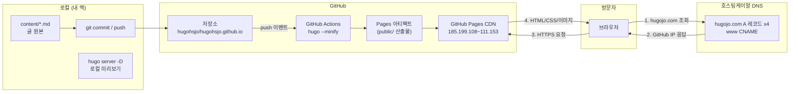
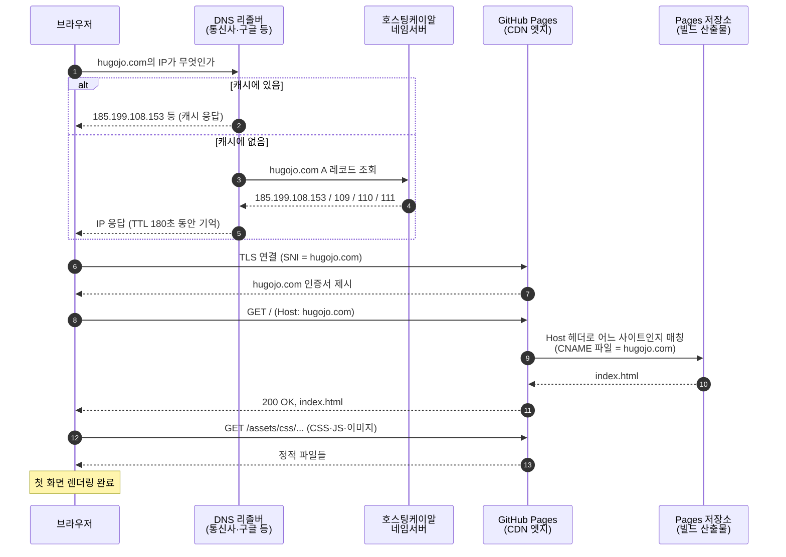
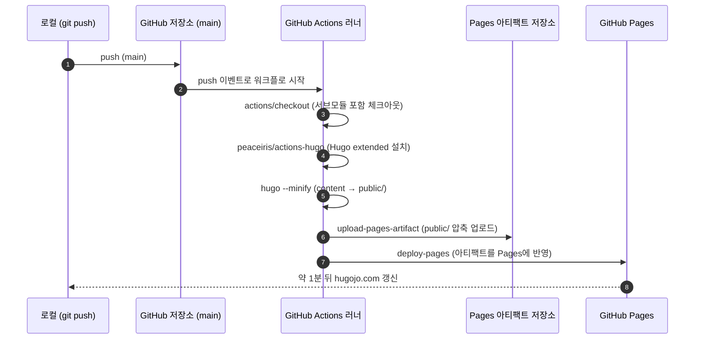
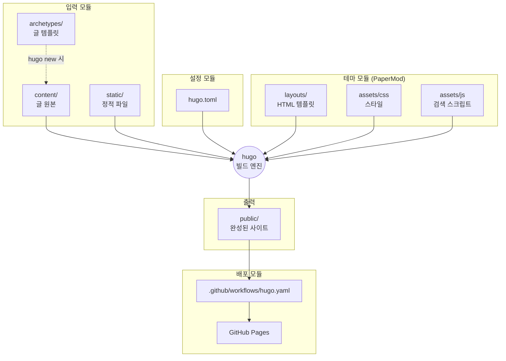
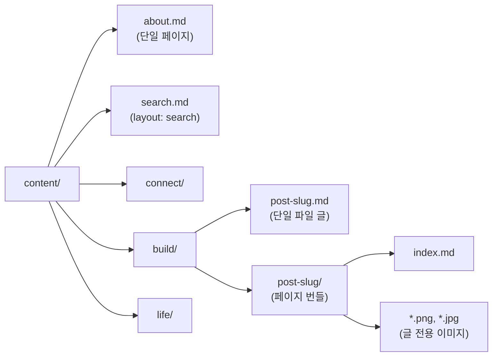
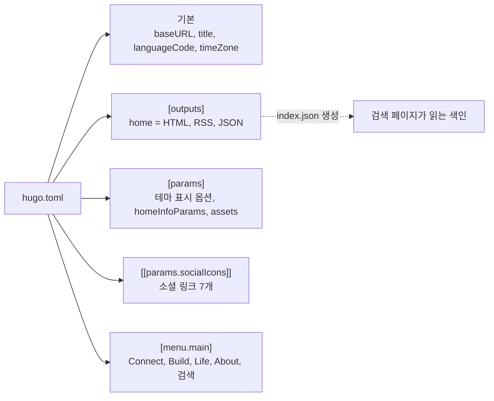
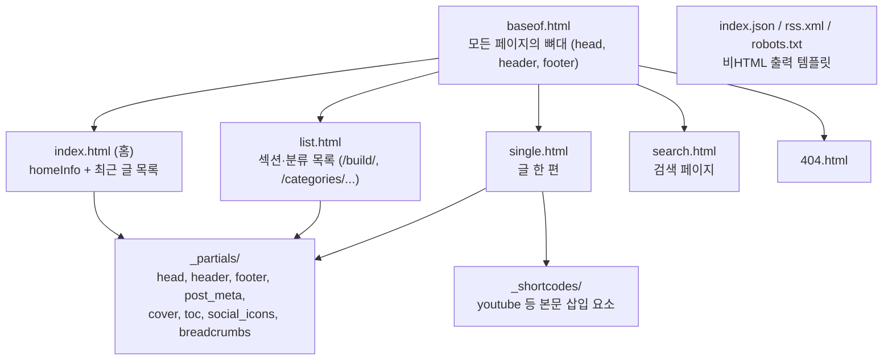
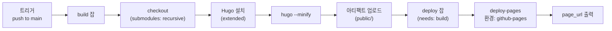

# ARCHITECTURE

hugojo.com 블로그의 시스템 구조 문서. 이 블로그가 무엇으로 이루어져 있고, 브라우저에 주소를 입력했을 때 무슨 일이 일어나며, 각 구성요소가 어떤 역할을 맡는지 설명한다. 처음 보는 사람도 이 문서만으로 전체 그림을 이해할 수 있게 쓴다.

관련 문서: [README](README.md) (시작 안내), [CONVENTIONS](CONVENTIONS.md) (글쓰기 규칙), [DEPLOYMENT](DEPLOYMENT.md) (배포·운영)

---

## 1. 개요

| 항목 | 값 |
|---|---|
| 서비스 | 휴고조 Hugo Jo 블로그 |
| 공개 주소 | https://hugojo.com (보조 주소 https://hugohsjo.github.io) |
| 성격 | 정적 사이트. 서버 프로그램도, 데이터베이스도 없다 |
| 생성기 | Hugo v0.165 (extended) |
| 테마 | PaperMod (git 서브모듈) |
| 호스팅 | GitHub Pages |
| 빌드·배포 | GitHub Actions (push 시 자동) |
| 원본 저장소 | github.com/hugohsjo/hugohsjo.github.io |
| 운영 비용 | 도메인 연 등록비 외 0원 |

**한 줄 요약**: 마크다운 글을 저장소에 push하면, GitHub Actions가 Hugo로 HTML을 만들어 GitHub Pages에 올리고, hugojo.com 방문자는 그 HTML을 받는다.

---

## 2. 전체 시스템 구성도



구성요소는 네 덩어리다. **로컬**에서 글을 쓰고, **GitHub**가 빌드와 호스팅을 맡고, **DNS**가 도메인과 GitHub 서버를 잇고, **방문자**는 완성된 정적 파일만 받는다.

---

## 3. 핵심 개념 설명 (처음 보는 개발자용)

### 정적 사이트 생성기 (Static Site Generator)

워드프레스 같은 블로그는 방문자가 올 때마다 서버가 데이터베이스를 읽어 페이지를 만든다. 정적 사이트는 반대로 **글을 쓸 때 한 번만 HTML을 만들어 두고**, 방문자에게는 그 파일을 그대로 준다. 서버 프로그램이 없으니 해킹당할 것도, 느려질 것도, 비용이 나갈 것도 없다. Hugo는 그 "HTML을 만들어 두는" 도구다. 마크다운 100편도 1초 안에 변환한다.

### 마크다운과 front matter

글은 `.md` 파일 하나다. 파일 맨 위 `---`로 감싼 부분이 **front matter**로, 제목·날짜·카테고리 같은 메타데이터를 YAML 형식으로 적는다. 그 아래가 본문이다. Hugo는 front matter를 읽어 목록·RSS·검색 색인을 만들고, 본문을 HTML로 바꾼다.

```
---            ← front matter 시작
title: "글 제목"
date: 2026-09-07T20:00:00+09:00
categories: ["Build"]
---            ← front matter 끝
본문은 여기서부터 마크다운으로.
```

### 테마와 서브모듈

테마는 "글을 어떤 HTML 틀에 끼울지"를 정하는 템플릿 묶음이다. PaperMod 테마는 남이 만든 오픈소스이고, 우리 저장소에는 복사본이 아니라 **git 서브모듈**로 연결되어 있다. 서브모듈은 "다른 저장소의 특정 커밋을 이 폴더에 가져다 놓는다"는 포인터다. 그래서 테마 파일을 직접 고치면 안 되고(업데이트 시 충돌), 꾸밈 변경은 우리 쪽 설정이나 덮어쓰기 파일로 한다.

### DNS와 A 레코드

인터넷은 이름이 아니라 숫자 주소(IP)로 통신한다. hugojo.com이라는 이름을 GitHub 서버의 IP로 바꿔 주는 전화번호부가 DNS이고, "이 이름은 이 IP"라고 적은 한 줄이 **A 레코드**다. 우리는 GitHub Pages가 공개한 IP 4개를 등록했다. 4개인 이유는 한 대가 죽어도 나머지가 받게 하기 위해서다. `www` 앞자리는 **CNAME 레코드**로 "hugohsjo.github.io와 같은 곳"이라고 별칭을 걸었다.

### CDN과 GitHub Pages

GitHub Pages는 우리 HTML을 전 세계에 분산된 서버(CDN)에 복사해 두고, 방문자와 가장 가까운 곳에서 응답한다. 우리는 서버를 관리하지 않는다. GitHub가 어떤 도메인 요청이 우리 사이트 것인지 아는 근거가 저장소의 `static/CNAME` 파일과 Pages 설정의 Custom domain이다.

### CI/CD (GitHub Actions)

"코드를 올리면 자동으로 빌드하고 배포한다"는 자동화다. `.github/workflows/hugo.yaml`에 절차가 적혀 있고, main 브랜치에 push가 일어날 때마다 GitHub가 빌린 리눅스 머신에서 그 절차를 실행한다. 사람이 빌드 명령을 칠 일이 없다.

---

## 4. 요청 흐름: 브라우저에 hugojo.com을 입력하면



핵심 두 지점:

- **5번, 인증서**: GitHub가 hugojo.com 이름으로 발급한 인증서를 내밀어야 자물쇠가 뜬다. 도메인을 처음 연결한 직후에는 발급 전이라 `*.github.io` 인증서가 나가고 브라우저가 경고를 띄운다. 발급은 GitHub가 자동으로 한다
- **8번, 사이트 매칭**: GitHub의 같은 IP로 수십만 사이트가 들어온다. 어느 저장소의 파일을 줄지는 요청의 Host 헤더와 저장소 CNAME 설정을 대조해 정한다. `static/CNAME`이 그래서 필요하다

보조 주소 hugohsjo.github.io로 들어오면 GitHub가 301로 hugojo.com으로 보낸다.

---

## 5. 빌드·배포 흐름: push하면 무슨 일이 일어나나



빌드 잡과 배포 잡이 분리되어 있다. 빌드가 실패하면 배포는 실행되지 않으므로, 깨진 사이트가 올라가는 일은 없다. 이전 버전이 그대로 서비스된다.

---

## 6. 디렉토리 구조

```
hugojo.com/
├── content/                  글 원본 (사람이 편집하는 유일한 영역)
│   ├── about.md              About 페이지  → /about/
│   ├── search.md             검색 페이지   → /search/
│   ├── connect/              Connect 축    → /connect/...
│   ├── build/                Build 축      → /build/...
│   └── life/                 Life 축       → /life/...
├── static/                   빌드 시 루트에 그대로 복사되는 파일
│   ├── CNAME                 "hugojo.com" 한 줄. Pages 도메인 매칭 근거
│   ├── favicon-32.png        파비콘
│   └── apple-touch-icon.png  iOS 홈 화면 아이콘
├── archetypes/
│   └── default.md            hugo new 실행 시 생성되는 글 템플릿
├── themes/
│   └── PaperMod/             테마 (git 서브모듈, 수정 금지)
├── .github/workflows/
│   └── hugo.yaml             빌드·배포 워크플로
├── hugo.toml                 사이트 설정 (제목·메뉴·소셜·검색 출력)
├── .gitmodules               서브모듈 등록 정보
├── .gitignore                public/, resources/ 등 산출물 제외
├── README.md                 시작 안내
├── ARCHITECTURE.md           이 문서
├── CONVENTIONS.md            글쓰기·커밋 규칙
├── DEPLOYMENT.md             배포·도메인·장애 대응
├── public/                   (로컬 빌드 산출물, git 미추적)
└── resources/                (Hugo 캐시, git 미추적)
```

---

## 7. 저장소 설정 (GitHub와 로컬)

### GitHub 쪽 설정 현황

| 항목 | 값 |
|---|---|
| 저장소 | hugohsjo/hugohsjo.github.io (Public) |
| 기본 브랜치 | main |
| Pages Source | GitHub Actions (build_type = workflow) |
| Pages Custom domain | hugojo.com |
| Enforce HTTPS | 인증서 발급 후 활성화 |
| Actions 권한 | contents: read, pages: write, id-token: write (워크플로에 명시) |
| About | 설명·웹사이트(hugojo.com)·주제(hugo, blog, github-pages) |

### 로컬 쪽 필요 세팅

| 항목 | 값 | 확인 명령 |
|---|---|---|
| Hugo extended | v0.165 이상 | `hugo version` |
| Git | 2.x | `git --version` |
| GitHub CLI | 2.x, hugohsjo 계정으로 로그인 | `gh auth status` |
| Git 신원 | Hugo Jo / hugohsjo@gmail.com | `git config user.email` |
| 클론 위치 | ~/Library/CloudStorage/Dropbox/Studio/hugojo.com | |
| 서브모듈 초기화 | 클론 직후 1회 | `git submodule update --init` |

새 머신에서 처음 세팅하는 절차는 [DEPLOYMENT.md 6장](DEPLOYMENT.md#6-새-머신에서-처음-세팅하기)에 있다.

---

## 8. Dependencies

| 의존성 | 버전 | 어디서 쓰이나 | 갱신 방법 |
|---|---|---|---|
| Hugo (extended) | 로컬 v0.165.0, CI는 latest | 마크다운 → HTML 변환 | 로컬 `brew upgrade hugo`. CI는 자동 최신 |
| PaperMod | 서브모듈 커밋 d376885 (v8.0 이후) | 테마 (레이아웃·CSS·검색 JS) | `git submodule update --remote themes/PaperMod` 후 커밋 |
| actions/checkout | v4 | 저장소 체크아웃 | 워크플로 파일에서 버전 변경 |
| peaceiris/actions-hugo | v3 | 러너에 Hugo 설치 | 동일 |
| actions/upload-pages-artifact | v3 | public/ 업로드 | 동일 |
| actions/deploy-pages | v4 | Pages 배포 | 동일 |
| Google Fonts | 없음 | 테마 기본 시스템 폰트 사용 | 해당 없음 |

외부 런타임 의존성은 0이다. 방문자 브라우저는 우리 HTML·CSS·JS와 테마의 검색 스크립트(fuse.js, 테마에 내장)만 받는다. 외부 분석 스크립트, 광고, 댓글 위젯은 없다.

**CI가 Hugo latest를 쓰는 것에 대한 주의**: 로컬과 CI의 Hugo 버전이 달라질 수 있다. 로컬에서 되던 빌드가 CI에서 깨지면 첫 의심은 Hugo 메이저 업데이트다. 그때는 워크플로의 `hugo-version`을 로컬 버전으로 고정한다.

---

## 9. 전체 패키지 구조 (모듈 관점)

Hugo 사이트는 응용 프로그램이 아니라 **입력(content) → 변환(theme + config) → 출력(public)** 파이프라인이다. 모듈은 이 세 단계와 배포로 나뉜다.



### 9.1 입력 모듈: content



- **섹션** = content 바로 아래 폴더. 섹션 이름이 URL 첫 조각이 되고(`/build/...`), 메뉴와 1:1로 대응한다
- **단일 파일 글** = 이미지가 없는 글. `slug.md` 하나
- **페이지 번들** = 이미지가 있는 글. `slug/index.md` + 이미지 파일들이 한 폴더. 이미지를 글 옆에 두면 파일명만으로 참조할 수 있고, 글을 옮기거나 지울 때 이미지도 함께 따라간다
- **front matter의 categories** = 축 이름. Hugo가 `/categories/build/` 같은 분류 페이지를 자동 생성한다

### 9.2 설정 모듈: hugo.toml



`[outputs]`의 JSON은 검색 기능의 생명줄이다. 홈 페이지를 JSON으로도 출력하면 `index.json`이 생기고, 검색 페이지의 스크립트가 이 파일을 내려받아 브라우저 안에서 검색한다. 서버 없이 검색이 되는 원리다.

### 9.3 테마 모듈: PaperMod 레이아웃



우리가 테마에 넘기는 것은 hugo.toml의 `params`뿐이다. 테마를 바꾸고 싶으면 (1) params로 되는지 먼저 보고, (2) 안 되면 저장소 루트에 `layouts/` 또는 `assets/css/extended/`를 만들어 같은 이름의 파일을 두면 테마 파일보다 우선 적용된다. 테마 폴더 안은 절대 건드리지 않는다.

### 9.4 배포 모듈: 워크플로



`submodules: recursive`가 없으면 테마가 빈 폴더로 체크아웃되어 빌드가 실패한다. `extended: true`는 PaperMod가 쓰는 SCSS 처리를 위해 필요하다. 이 두 옵션이 이 워크플로에서 가장 자주 사고가 나는 지점이다.

---

## 10. 보안과 개인정보

- 서버 코드가 없으므로 서버 취약점이 없다. 공격 표면은 GitHub 계정(2단계 인증 필수)과 도메인 등록기관 계정(자동연장·잠금 권장) 두 곳이다
- 방문자 데이터를 수집하지 않는다. 쿠키 없음, 분석 스크립트 없음, 댓글 없음
- 저장소가 Public이므로 content에 비공개 정보(개인 연락처 외 민감 정보, API 키, 내부 문서)를 절대 넣지 않는다. 초안은 `draft: true`여도 저장소에는 공개된다는 점을 기억한다
