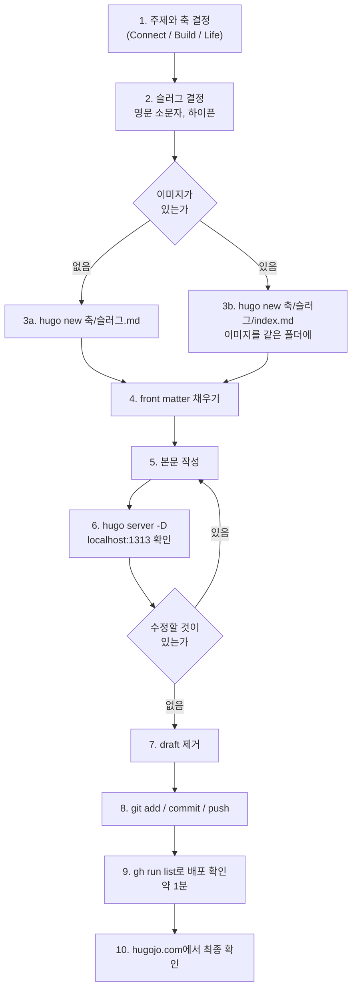
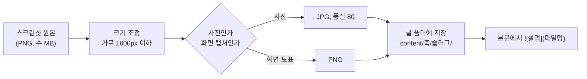

# CONVENTIONS

글을 쓰고 저장소를 다루는 규칙. 순서대로 따라 하면 글 한 편이 발행된다. 규칙의 이유도 같이 적어, 판단이 필요한 상황에서 스스로 결정할 수 있게 한다.

관련 문서: [ARCHITECTURE](ARCHITECTURE.md) (구조), [DEPLOYMENT](DEPLOYMENT.md) (배포·장애)

---

## 1. 글 발행 전체 흐름



---

## 2. 단계별 상세

### 1단계. 주제와 축

축은 셋 중 하나만 고른다. 한 글이 두 축에 걸치면 더 강한 쪽 하나로 정한다.

| 축 | 내용 | 폴더 | 제목 유형 |
|---|---|---|---|
| Connect | AWS Amazon Connect, AI 컨택센터 구축 | `content/connect/` | 검색어형 |
| Build | 앱·웹서비스 개발, 출시, 운영 | `content/build/` | 검색어형 |
| Life | 만드는 사람의 생각, 결정의 이유 | `content/life/` | 자유 |

### 2단계. 슬러그 (파일명 = URL)

- 영문 소문자, 숫자, 하이픈만. 한글·공백·언더스코어 금지
- 글의 핵심 검색어를 영어로. 예: `first-call-routing`, `app-store-rejection`, `gageboo-revenue-2026-09`
- 한 번 발행한 슬러그는 바꾸지 않는다. URL이 바뀌면 외부 링크와 검색 순위가 끊긴다. 꼭 바꿔야 하면 front matter에 `aliases: ["/build/old-slug/"]`를 추가해 옛 주소를 살린다

### 3단계. 파일 만들기

저장소 루트에서 실행한다.

이미지 없는 글:
```bash
hugo new build/app-store-rejection.md
```

이미지 있는 글 (페이지 번들):
```bash
hugo new build/app-store-rejection/index.md
```

둘 다 `archetypes/default.md`를 템플릿으로 파일이 생성되고, 아래 front matter가 채워진 채 열린다.

### 4단계. front matter 규격

```yaml
---
title: "앱스토어 심사 리젝 두 번 겪고 정리한 대응법"
date: 2026-09-07T20:00:00+09:00
draft: true
categories: ["Build"]
tags: ["AppStore", "심사", "iOS"]
summary: "리젝 사유 2건의 전문과 소명 대신 수정을 택한 이유. 재제출까지 하루."
---
```

| 키 | 규칙 |
|---|---|
| title | 검색어형. 타깃 검색어로 시작. 따옴표로 감싼다 |
| date | 발행 시각. `+09:00` 유지. 미래 시각이면 그 시각까지 빌드에서 제외된다(예약 발행 효과) |
| draft | 작성 중 `true`. 발행 시 줄을 지우거나 `false` |
| categories | 축 이름 하나만. 대문자 시작: `Connect`, `Build`, `Life` |
| tags | 3~5개. 검색어 단위. 같은 뜻은 같은 표기로 통일 (예: `AmazonConnect`) |
| summary | 목록·검색 결과·SNS 미리보기에 쓰이는 1~2문장. 비우면 본문 앞부분이 잘려 나가 어색해진다 |

선택 키:

| 키 | 용도 |
|---|---|
| `cover: {image: "cover.png", alt: "설명"}` | 글 상단 표지 이미지 (페이지 번들 안의 파일명) |
| `ShowToc: true` | 긴 글에 목차 표시 |
| `aliases: ["/old/url/"]` | 옛 주소 리다이렉트 |
| `weight: 1` | 섹션 목록에서 위로 고정 (허브 글에 사용) |

### 5단계. 본문 작성

권장 구조:

```
(도입 2~3줄)  어떤 문제를 풀었는가. 핵심 키워드를 문장 안에 자연스럽게
## 소제목      과정, 코드, 스크린샷
## 소제목      ...
(영상 임베드)  
(마무리)       다음 단계 예고 한 줄 + YouTube 채널 안내 한 줄
```

마크다운 요소:

| 요소 | 문법 | 비고 |
|---|---|---|
| 소제목 | `## 제목` | `#` 하나는 쓰지 않는다 (title이 h1) |
| 코드 | ```` ```swift ```` 처럼 언어 지정 | 복사 버튼이 자동으로 붙는다 |
| 이미지 | `` | 페이지 번들 안 파일. 설명(alt)은 비우지 않는다 |
| 유튜브 | `` | 영상 ID만. URL 전체가 아니다 |
| 링크 | `[텍스트](https://...)` | 내부 글은 `/build/slug/` 형식 |
| 인용 | `> 문장` | |
| 표 | 파이프 표 | 넓은 표는 모바일에서 가로 스크롤된다 |

### 6단계. 미리보기

```bash
hugo server -D
```

http://localhost:1313 에서 확인한다. `-D`는 draft를 포함해 보여준다. 파일을 저장하면 브라우저가 자동 새로고침된다. 종료는 Ctrl+C.

확인할 것: 제목·요약이 목록에서 어떻게 보이는지, 이미지가 깨지지 않는지, 코드 블록 언어 강조가 맞는지, 모바일 폭(브라우저 창을 좁혀서)에서 표가 넘치지 않는지.

### 7~8단계. 발행

`draft: true` 줄을 지우고:

```bash
git add -A && git commit -m "post: 앱스토어 심사 리젝 대응법" && git push
```

### 9~10단계. 배포 확인

```bash
gh run list --limit 1
```

`completed success`가 뜨면 hugojo.com에서 글 주소를 연다. 실패하면 [DEPLOYMENT.md 7장](DEPLOYMENT.md#7-장애-대응)을 본다.

---

## 3. 이미지 규칙



| 규칙 | 값 | 이유 |
|---|---|---|
| 위치 | 글과 같은 폴더 (페이지 번들) | 글을 옮기면 이미지도 따라간다. `static/`에 흩어 두면 관리가 안 된다 |
| 파일명 | 영문 소문자, 하이픈, 의미 있는 이름 (`rejection-mail.png`) | `IMG_1234.png`는 나중에 무엇인지 모른다 |
| 가로 폭 | 1600px 이하 | 본문 폭이 약 700px이라 그 이상은 용량 낭비 |
| 용량 | 장당 300KB 이하 목표 | 저장소가 커지면 클론과 빌드가 느려진다 |
| 포맷 | 화면 캡처·도표는 PNG, 사진은 JPG | 캡처는 PNG가 선명, 사진은 JPG가 가볍다 |
| alt 텍스트 | 항상 채운다 | 검색엔진과 스크린리더가 읽는다 |

맥에서 일괄 크기 조정 (글 폴더 안에서):

```bash
sips -Z 1600 *.png
```

`static/`에 두는 이미지는 사이트 공통 자산(파비콘, 기본 OG 이미지)뿐이다. 글 이미지는 넣지 않는다.

---

## 4. 글쓰기 문체 규칙

이 블로그의 공개 문구 전체에 적용된다.

1. 대시 기호(긴 줄표)를 쓰지 않는다. 마침표, 쉼표, 괄호로 푼다
2. 경력을 연차로 표현하지 않는다. 경력은 이야기로 쓴다
3. "매주", "매일" 같은 발행 주기 약속을 글에 적지 않는다
4. 기술 이름을 나열만 하는 문장을 피한다. 왜 그 선택을 했는지가 항상 함께 간다
5. 제목은 검색어로 시작한다. 브랜드 문장은 블로그 제목이 담당하므로 글 제목에 반복하지 않는다
6. 본문 첫 세 줄 안에 이 글이 푸는 문제가 드러나야 한다

---

## 5. 허브 글과 내부 링크

축마다 총정리 글(허브) 1편을 둔다. 허브는 그 축의 모든 글로 링크하고, 모든 글은 마무리에서 허브로 링크한다. 검색엔진이 이 구조를 시리즈의 권위로 읽는다.

- 허브 글은 front matter에 `weight: 1`을 주어 섹션 목록 맨 위에 고정한다
- 새 글을 발행하면 허브 글의 목록에 한 줄 추가하는 것까지가 발행이다

---

## 6. Git 규칙

| 항목 | 규칙 |
|---|---|
| 브랜치 | main 하나만 쓴다. push가 곧 배포이므로 브랜치를 나눌 이유가 없다 |
| 커밋 단위 | 글 1편 = 커밋 1개. 여러 글을 한 커밋에 섞지 않는다 |
| 커밋 메시지 | `type: 요약` 형식. type은 아래 표 |
| 신원 | Hugo Jo / hugohsjo@gmail.com (`git config user.email`로 확인) |
| 하지 않는 것 | force push, 테마 폴더 직접 수정, public/ 커밋 |

| type | 용도 | 예 |
|---|---|---|
| post | 글 발행·수정 | `post: Amazon Connect 구축 1편` |
| fix | 오타·링크·이미지 수정 | `fix: 리젝 글 이미지 경로` |
| feat | 사이트 기능·설정 변경 | `feat: 카테고리 메뉴 추가` |
| chore | 도메인·의존성·워크플로 | `chore: PaperMod 업데이트` |
| docs | 저장소 문서 | `docs: CONVENTIONS 이미지 규칙` |

---

## 7. 하지 말아야 할 것 (자주 나는 사고)

| 행동 | 결과 | 대신 |
|---|---|---|
| `themes/PaperMod/` 안의 파일 수정 | 테마 업데이트 시 충돌, 변경 소실 | 루트 `layouts/` 또는 `assets/css/extended/`로 덮어쓰기 |
| `public/`을 git에 추가 | 저장소 비대, CI 산출물과 충돌 | `.gitignore`에 이미 제외됨. 그대로 둔다 |
| `[outputs]`에서 JSON 삭제 | 검색 페이지가 빈 결과 | 유지 |
| `static/CNAME` 삭제·수정 | 도메인 연결 해제, 사이트 접속 불가 | 절대 손대지 않는다 |
| 한글 파일명 | URL이 퍼센트 인코딩되어 지저분, 일부 환경 깨짐 | 영문 슬러그 |
| 발행 후 슬러그 변경 | 기존 링크 전부 404 | aliases로 옛 주소 유지 |
