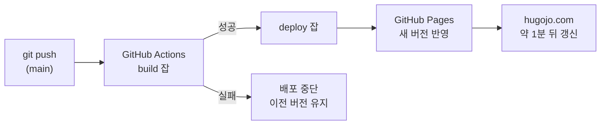
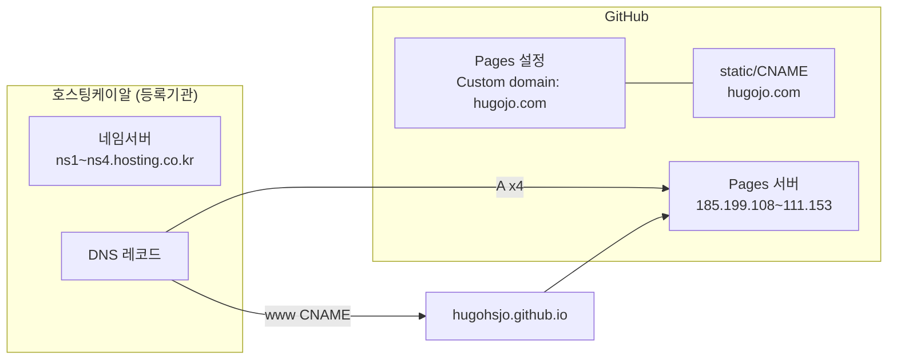
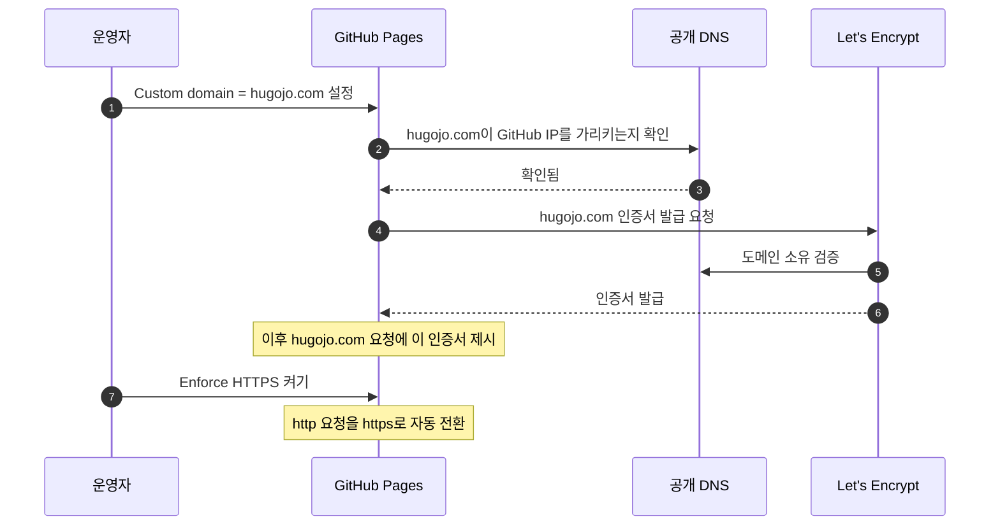
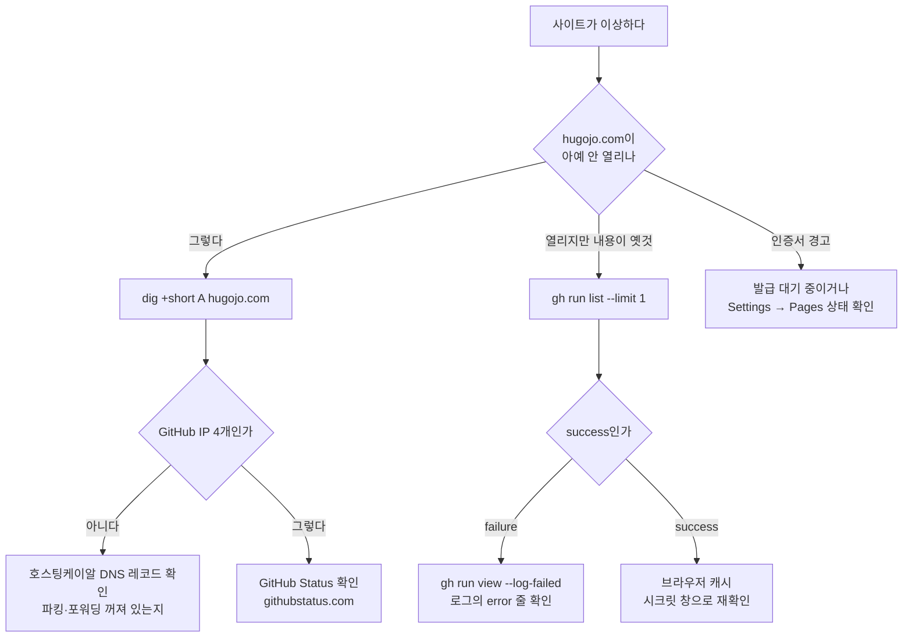

# DEPLOYMENT

배포, 도메인, HTTPS, 장애 대응, 새 머신 세팅. 사이트가 어떻게 세상에 나가고, 문제가 생기면 어디를 봐야 하는지 적는다.

관련 문서: [ARCHITECTURE](ARCHITECTURE.md) (구조), [CONVENTIONS](CONVENTIONS.md) (글쓰기)

---

## 1. 배포 파이프라인 한눈에



- 트리거: main 브랜치 push
- 소요: 보통 30초~1분
- 롤백: 잘못 올라갔으면 `git revert`로 되돌리는 커밋을 push한다. 그 push가 다시 배포를 일으켜 이전 상태로 돌아간다

---

## 2. 워크플로 파일 해설

`.github/workflows/hugo.yaml` 전문과 각 줄의 의미:

```yaml
name: Deploy Hugo site to Pages
on:
  push:
    branches: [main]            # main에 push될 때만 실행
permissions:
  contents: read                # 저장소 읽기
  pages: write                  # Pages에 배포
  id-token: write               # Pages 배포 인증 토큰
jobs:
  build:
    runs-on: ubuntu-latest
    steps:
      - uses: actions/checkout@v4
        with: { submodules: recursive }      # 테마 서브모듈까지 받는다 (없으면 빌드 실패)
      - uses: peaceiris/actions-hugo@v3
        with: { hugo-version: 'latest', extended: true }   # extended 필수 (SCSS)
      - run: hugo --minify                    # content -> public/ 생성, 압축
      - uses: actions/upload-pages-artifact@v3
        with: { path: ./public }             # public/을 배포 아티팩트로 업로드
  deploy:
    needs: build                             # build 성공 시에만
    runs-on: ubuntu-latest
    environment:
      name: github-pages
      url: ${{ steps.deployment.outputs.page_url }}
    steps:
      - id: deployment
        uses: actions/deploy-pages@v4        # 아티팩트를 Pages에 반영
```

변경이 필요한 경우는 두 가지뿐이다. Hugo 버전 고정(`hugo-version: '0.165.0'`)과 액션 메이저 버전 업그레이드.

---

## 3. 배포 상태 확인

```bash
gh run list --limit 3
```

```
completed  success  post: ...  Deploy Hugo site to Pages  main  push  ...
```

실패한 실행의 로그 보기:

```bash
gh run view --log-failed
```

브라우저: 저장소 → Actions 탭.

---

## 4. 도메인과 DNS

### 4.1 구성



### 4.2 등록된 DNS 레코드 (호스팅케이알)

| 유형 | 호스트 | 값 | TTL |
|---|---|---|---|
| A | @ | 185.199.108.153 | 180 |
| A | @ | 185.199.109.153 | 180 |
| A | @ | 185.199.110.153 | 180 |
| A | @ | 185.199.111.153 | 180 |
| CNAME | www | hugohsjo.github.io | 180 |

IP 출처: [GitHub Docs, Managing a custom domain](https://docs.github.com/en/pages/configuring-a-custom-domain-for-your-github-pages-site/managing-a-custom-domain-for-your-github-pages-site)

파킹, 포워딩은 꺼 둔다. 켜면 GitHub 연결과 충돌한다.

### 4.3 GitHub 쪽 설정

| 위치 | 값 |
|---|---|
| 저장소 `static/CNAME` | `hugojo.com` (빌드 시 public/CNAME으로 복사됨) |
| 저장소 Settings → Pages → Custom domain | hugojo.com |
| `hugo.toml` baseURL | `https://hugojo.com/` |

세 곳이 모두 일치해야 한다. 하나라도 다르면 리다이렉트 루프나 잘못된 링크가 생긴다.

### 4.4 DNS 확인 명령

```bash
dig +short A hugojo.com
```

GitHub IP 4개가 나오면 정상. 옛 값이 나오면 캐시이므로 TTL(180초)만큼 기다린다.

```bash
dig +short CNAME www.hugojo.com
```

`hugohsjo.github.io.`가 나오면 정상.

---

## 5. HTTPS 인증서



- 발급은 자동이며 DNS 전파 후 통상 1시간 이내, 최대 24시간
- **커스텀 도메인은 반드시 Settings → Pages 화면에서 Save로 등록한다.** API로만 설정하면 "DNS Check in Progress"에서 멈춰 인증서 발급이 시작되지 않는다(2026-09-03 실제 발생). 멈췄으면 Remove → 재입력 → Save로 검사를 다시 돌린다. 이후 "DNS check successful"이 떠도 인증서 요청이 큐에 들어가 "TLS certificate is being provisioned (1 of 3)" 문구가 나타나기까지 1~2시간이 더 걸릴 수 있다(2026-09-03 실제: 20:50 재저장 → 약 22:20 발급 절차 시작). 그 문구가 보이면 정상 진행 중이므로 손대지 않는다
- 발급 전에는 GitHub가 `*.github.io` 인증서를 내밀어 브라우저가 `ERR_CERT_COMMON_NAME_INVALID` 경고를 띄운다. 정상 과정이다
- 발급 상태는 저장소 Settings → Pages 화면에서 확인한다. "Enforce HTTPS" 체크박스가 활성화되면 발급 완료
- 인증서는 Let's Encrypt가 90일 단위로 발급하고 GitHub가 자동 갱신한다. 운영자가 할 일은 없다

Enforce HTTPS를 명령으로 켜기 (발급 후):

```bash
gh api -X PUT repos/hugohsjo/hugohsjo.github.io/pages -F https_enforced=true
```

발급 전에는 "The certificate does not exist yet" 오류가 난다.

---

## 6. 새 머신에서 처음 세팅하기

```bash
brew install hugo gh
```

```bash
gh auth login
```

(브라우저에서 hugohsjo 계정으로 로그인)

```bash
git clone https://github.com/hugohsjo/hugohsjo.github.io.git ~/Library/CloudStorage/Dropbox/Studio/hugojo.com
```

```bash
cd ~/Library/CloudStorage/Dropbox/Studio/hugojo.com && git submodule update --init
```

```bash
git config --global user.name "Hugo Jo" && git config --global user.email "hugohsjo@gmail.com"
```

```bash
hugo server -D
```

http://localhost:1313 이 열리면 세팅 완료.

두 GitHub 계정을 함께 쓰는 경우: `gh auth login`을 계정마다 실행해 두고, 필요할 때 `gh auth switch -u <계정>`으로 전환한다. 특정 폴더에서 다른 Git 신원을 쓰려면 `~/.gitconfig`의 `includeIf` 설정을 쓴다 (현재 맥은 `~/Documents/Product/` 아래에서 oxjohs 신원이 자동 적용되도록 설정됨).

---

## 7. 장애 대응



### 자주 나는 문제와 처방

| 증상 | 원인 | 처방 |
|---|---|---|
| 빌드 실패: `theme not found` | 서브모듈 체크아웃 누락 | 워크플로에 `submodules: recursive`가 있는지 확인. 로컬은 `git submodule update --init` |
| 빌드 실패: `failed to unmarshal YAML` | front matter 문법 오류 (따옴표, 들여쓰기) | 해당 글의 `---` 블록 확인 |
| 빌드 실패: `error building site` + 날짜 | date 형식 오류 | `2026-09-07T20:00:00+09:00` 형식으로 |
| 글이 안 보임 | `draft: true` 남아 있거나 date가 미래 | front matter 확인 |
| 검색이 빈 결과 | `[outputs]`에서 JSON 빠짐 | hugo.toml 복구 |
| 이미지 깨짐 | 파일명 대소문자 불일치 (리눅스는 구분) | 파일명과 본문 참조를 소문자로 통일 |
| CSS 없이 깨진 화면 | baseURL 불일치 | hugo.toml의 baseURL이 `https://hugojo.com/`인지 |
| 사이트 전체 404 | `static/CNAME` 삭제됨 | 파일 복구 후 push |
| 로컬은 되는데 CI만 실패 | Hugo 버전 차이 | 워크플로 `hugo-version`을 로컬 버전으로 고정 |

### 롤백

```bash
git log --oneline -5
```

```bash
git revert <되돌릴 커밋 해시> && git push
```

revert는 이력을 지우지 않고 "반대 변경"을 새 커밋으로 올리므로 안전하다. force push는 쓰지 않는다.

---

## 8. 정기 점검

| 주기 | 항목 | 방법 |
|---|---|---|
| 글 발행 때마다 | 배포 성공 | `gh run list --limit 1` |
| 월 1회 | 테마 업데이트 여부 | `git submodule update --remote themes/PaperMod` 후 로컬 빌드 확인, 문제 없으면 커밋 |
| 분기 1회 | 도메인 만료일·자동연장 | 호스팅케이알 도메인 상세 |
| 분기 1회 | 액션 버전 | 워크플로의 `@v4` 등 최신 메이저 확인 |
| 연 1회 | GitHub 계정 2단계 인증·복구 코드 | GitHub Settings → Security |
